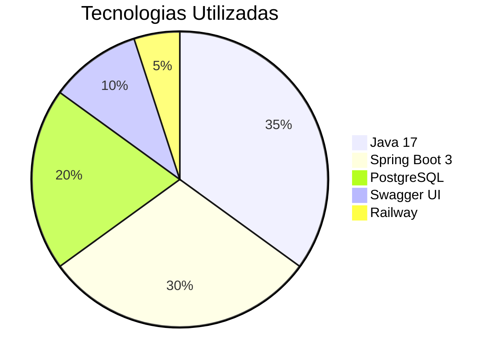

# 📚 API de Livros - Portfólio Profissional


API REST profissional para gerenciamento de acervo literário com integração ao Google Books, desenvolvida como projeto de portfólio para demonstrar habilidades avançadas em Java Backend e boas práticas de desenvolvimento.

## 🌟 Destaques do Projeto

### 🚀 Em Produção
- **Deploy contínuo** no Railway
- **Disponível 24/7** com monitoramento
- **Escalável** e pronto para produção

### 🔍 Features Técnicas
```markdown
- ✅ **CRUD completo** com validações customizadas
- 🔍 **Integração em tempo real** com Google Books API
- 📄 **Documentação profissional** com Swagger UI customizado
- 🛡️ **Segurança** com tratamento global de erros
- ⚡ **Performance** com Hibernate otimizado
- 🔄 **CI/CD** integrado com Railway
```

## 🖼️ Demonstração Visual

| Swagger UI | Endpoint de Livros | Console PostgreSQL |
|------------|-------------------|-------------------|
|  |  |  |

## 🛠 Stack Tecnológica



## 🚀 Como Executar

### ▶️ Localmente
```bash
git clone https://github.com/isadorabitt/api-livros.git
cd api-livros
./mvnw spring-boot:run
```

### 🌐 Acesso Online
A API está disponível em produção:  
🔗 [https://api-livros.up.railway.app/docs](https://api-livros.up.railway.app/docs)

## 📚 Endpoints Principais

| Método | Endpoint       | Descrição          | Exemplo |
|--------|---------------|-------------------|---------|
| GET    | /api/livros   | Lista todos livros | [Ver](img/example-get.png) |
| POST   | /api/livros   | Adiciona novo livro| [Ver](img/example-post.png) |
| GET    | /api/livros/{id} | Busca por ID | [Ver](img/example-get-id.png) |

## 🏗 Estrutura do Código

```bash
src/
├── main/
│   ├── java/
│   │   └── com/isadora/api_livros/
│   │       ├── config/       # Configurações avançadas
│   │       ├── controller/   # REST Controllers
│   │       ├── dto/          # Data Transfer Objects  
│   │       ├── exception/    # Tratamento de erros
│   │       ├── model/        # Entidades JPA
│   │       ├── repository/   # Spring Data JPA
│   │       ├── service/      # Lógica de negócio
│   │       └── integration/  # Integrações externas
│   └── resources/
│       ├── application.yml   # Configurações multi-ambiente
└── test/                     # Testes automatizados
```

## 📌 Lições Aprendidas

```markdown
1. 🔄 **CI/CD Avançado**: Configuração profissional de pipelines no Railway
2. 🛡️ **Segurança**: Implementação de tratamento global de exceções
3. 📊 **Otimização**: Técnicas avançadas de performance com Hibernate
4. 🌐 **Integração**: Consumo eficiente de APIs externas (Google Books)
5. 📄 **Documentação**: Boas práticas em documentação de APIs com OpenAPI
```

## 📞 Contato Profissional

**Isadora Bittencourt**  
👩‍💻 Desenvolvedora Java Backend  
📧 isadorabittencourt2@gmail.com  
🔗 [LinkedIn](https://linkedin.com/in/isadorabitt)  
🐙 [GitHub](https://github.com/isadorabitt)  
💼 Disponível para oportunidades como **Java Developer Pleno**

---

📜 **Licença MIT** - © 2024 Isadora Bittencourt  
[](https://opensource.org/licenses/MIT)

---

✨ **Dica**: Adicione um vídeo demonstrativo de 1 minuto mostrando:
1. Acesso ao Swagger em produção
2. Teste de endpoints críticos
3. Visualização dos logs e monitoramento

Use [Loom](https://www.loom.com) para gravar e embedar no README!