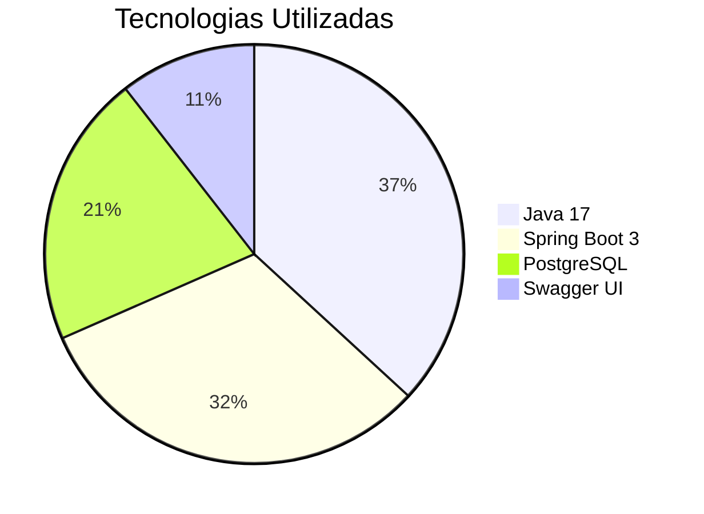

# 📚 API de Livros - Portfólio Profissional


API REST profissional para gerenciamento de acervo literário com integração ao Google Books, desenvolvida como projeto de portfólio para demonstrar habilidades avançadas em Java Backend e boas práticas de desenvolvimento.


### 🔍 Features Técnicas
```markdown
- ✅ **CRUD completo** com validações customizadas
- 🔍 **Integração em tempo real** com Google Books API
- 📄 **Documentação profissional** com Swagger UI customizado
- 🛡️ **Segurança** com tratamento global de erros
- ⚡ **Performance** com Hibernate otimizado
```

## 🛠 Stack Tecnológica



## 🚀 Como Executar

### ▶️ Localmente
```bash
git clone https://github.com/isadorabitt/api-livros.git
cd api-livros
./mvnw spring-boot:run
```
## 📚 Documentação da API

1. Via Swagger UI
   Acesse a documentação interativa em:

🔗 http://localhost:8080/swagger-ui.html

##  Collection Postman
```bash
https://www.postman.com/spacecraft-cosmonaut-18784533/workspace/isadora-projects/collection/27940812-0d2a751a-ce32-483c-9e4a-3f8b58c40a32?action=share&creator=27940812&active-environment=27940812-de5db57e-fa1a-426e-a9d4-ad17e13d36aa
```


## 📚 Endpoints da API

| Método | Endpoint                      | Descrição                                   | Parâmetros                           | Exemplo de Request/Response |
|--------|-------------------------------|--------------------------------------------|--------------------------------------|-----------------------------|
| GET    | `/api/livros`                 | Lista paginada com filtros                 | `?page=0&size=10&titulo={busca}`     | [🔍 Ver exemplo](#)         |
| POST   | `/api/livros`                 | Cadastra novo livro                        | `Body: JSON do livro`                | [📝 Ver modelo](#)          |
| GET    | `/api/livros/{id}`            | Busca livro por ID                         | `Path: UUID do livro`                | [🆔 Ver exemplo](#)         |
| PUT    | `/api/livros/{id}`            | Atualiza livro completo                    | `Path: UUID + Body: JSON atualizado` | [✏️ Ver exemplo](#)        |
| PATCH  | `/api/livros/{id}`            | Atualização parcial do livro               | `Path: UUID + Campos específicos`    | [🔄 Ver exemplo](#)        |
| DELETE | `/api/livros/{id}`            | Remove livro                               | `Path: UUID do livro`                | [🗑️ Ver exemplo](#)       |
| GET    | `/api/google-books`           | Busca livros na API Google Books           | `?q=termo&maxResults=5`              | [🔎 Ver exemplo](#)       |
| POST   | `/api/google-books/importar`  | Importa livro do Google Books para o local | `Body: ID do livro Google`           | [📥 Ver exemplo](#)       |

**Legenda de ícones**:
- 🔍 - Consulta com filtros
- 📝 - Payload JSON completo
- 🆔 - Busca por identificador
- ✏️ - Atualização total
- 🔄 - Atualização parcial
- 🗑️ - Operação destrutiva
- 🔎 - Integração externa
- 📥 - Importação de dados
## 🏗 Estrutura do Código

```bash
src/
├── main/
│   ├── java/
│   │   └── com/isadora/api_livros/
│   │       ├── config/       # Configurações avançadas
│   │       ├── controller/   # REST Controllers
│   │       ├── dto/          # Data Transfer Objects  
│   │       ├── exception/    # Tratamento de erros
│   │       ├── model/        # Entidades JPA
│   │       ├── repository/   # Spring Data JPA
│   │       ├── service/      # Lógica de negócio
│   │       └── integration/  # Integrações externas
│   └── resources/
│       ├── application.yml   # Configurações multi-ambiente
└── test/                     # Testes automatizados
```

## 📌 Lições Aprendidas

```markdown
1. 🔄 **CI/CD Avançado**: Configuração profissional de pipelines no Railway
2. 🛡️ **Segurança**: Implementação de tratamento global de exceções
3. 📊 **Otimização**: Técnicas avançadas de performance com Hibernate
4. 🌐 **Integração**: Consumo eficiente de APIs externas (Google Books)
5. 📄 **Documentação**: Boas práticas em documentação de APIs com OpenAPI
```

## 📞 Contato Profissional

**Isadora Bittencourt**  
👩‍💻 Desenvolvedora Java Backend  
📧 isadorabittencourt22@gmail.com  
🔗 [LinkedIn](https://linkedin.com/in/isadorabitt)  
🐙 [GitHub](https://github.com/isadorabitt)  
💼 Disponível para oportunidades como **Java Developer Pleno**

---

📜 **Licença MIT** - © 2024 Isadora Bittencourt  
[](https://opensource.org/licenses/MIT)

---

